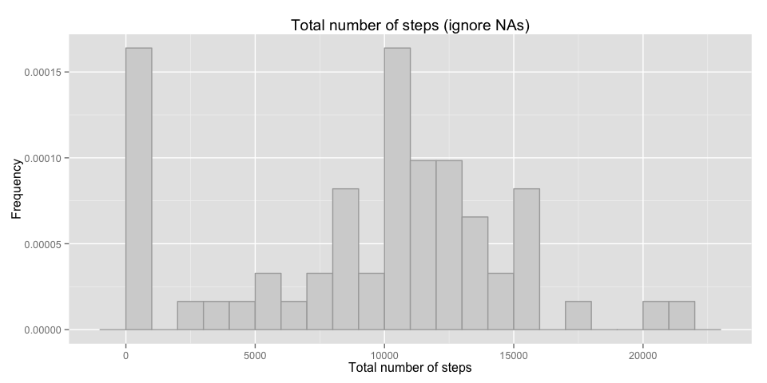
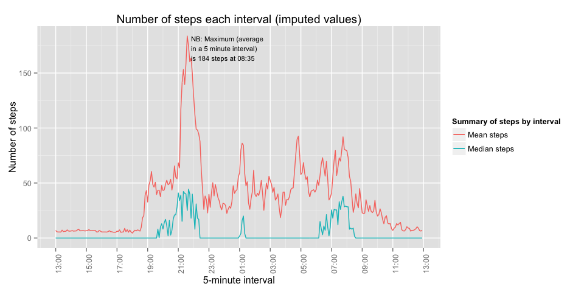

# Reproducible Research: Peer Assessment 1
MazinMelb  
9 Jan 2016  


## Loading and preprocessing the data


```r
setwd("~/Documents/RepData_PeerAssessment1")

fname <- "activity.csv"
activities <- read.csv(fname)

# add boolean for weekend / weekday
activities <- activities %>%
              mutate(weekday=
                  substr(weekdays(as.POSIXct(date)),1,1)!="S")

# add POXIXct class version of the interval
timechar <- str_pad(as.character(activities$interval),4,side="left",pad="0") 
timeperiod <- sapply(timechar,function(x)
                    str_c(substr(x,1,2),":",substr(x,3,4)))

activities <- cbind(activities,timeperiod)


# summarise mean and median for each interval (ignore NAs)
actsummary <- activities %>%
              group_by(date) %>%
              summarise(msteps = mean(steps,na.rm=TRUE),
                        medsteps = median(steps,na.rm=TRUE),
                        min(steps,na.rm=TRUE),
                        max(steps,na.rm=TRUE),
                        weekday=unique(weekday))
```


## What is mean total number of steps taken per day?

 


## What is the average daily activity pattern?


```
## $title
## [1] "Number of steps each interval"
## 
## attr(,"class")
## [1] "labels"
```

 


## Imputing missing values


## What is the average daily activity pattern?


```
## $title
## [1] "Number of steps each interval"
## 
## attr(,"class")
## [1] "labels"
```

 


## Are there differences in activity patterns between weekdays and weekends?

